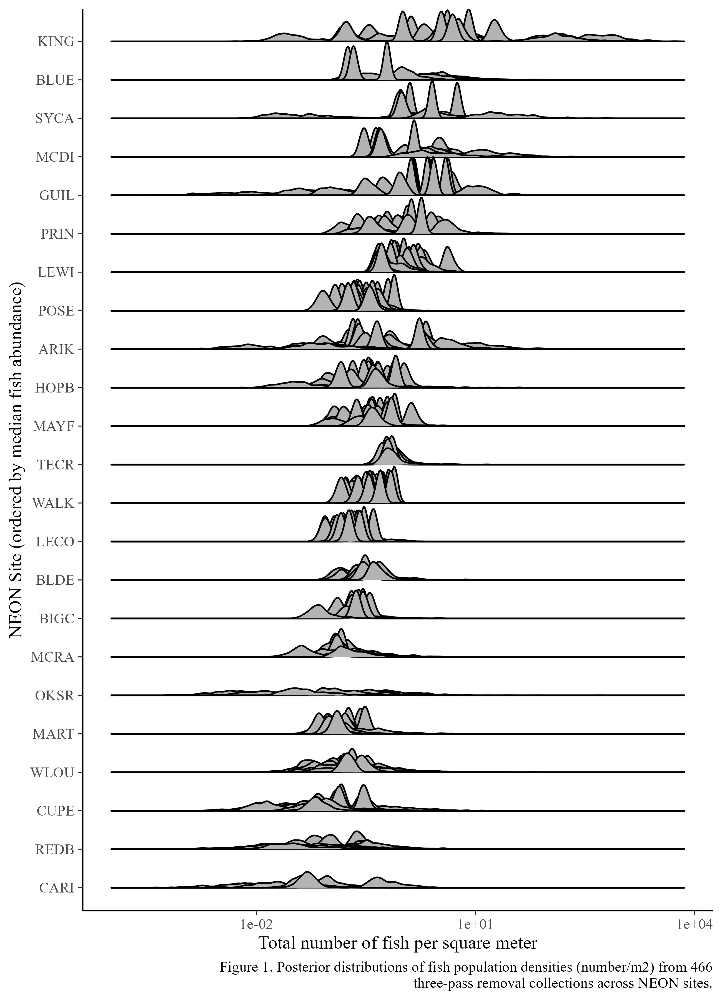
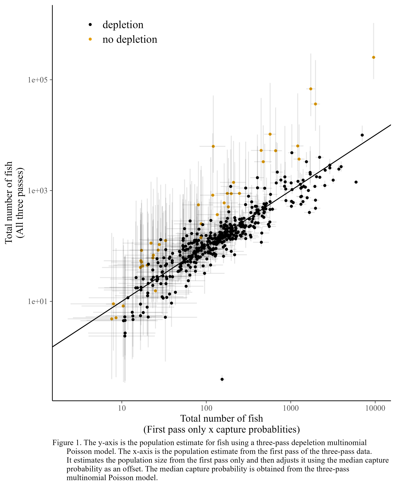

NEON fish population estimates
================
Jeff Wesner
2023-12-19

## Purpose

This repository estimates fish population sizes using the NEON
electrofishing data. After wrangling the NEON fish data, we estimate
population sizes using a Bayesian multinomial Poisson model with the
`ubms` package.

## Data sets

The following NEON data sets are used:

- DP1.20107.001 - [Fish electrofishing, gill netting, and fyke netting
  counts](https://data.neonscience.org/data-products/DP1.20107.001)
- DP1.20190.001 - [Reaeration field and lab
  collection](https://data.neonscience.org/data-products/DP1.20190.001)

## The wrangling is the hardest part

In a perfect world, we could download data directly from NEON that gave
us the *number of fish caught per pass* along with the *sampling area*
and associated identifiers (fish species, site, date, reach, etc.).
Instead, we have to piece these together. The code to do this is in
`code/01_fish_get-pass-data.R`. A short narrative is below.

### 1) Calculate sampling area

For each electrofishing pass, NEON records the length (m) of the pass in
`DP1.20190.001$fsh_fieldData$measuredReachLength.` However, they do not
record stream widths per pass. For these we need to use
`DP1.20190.001$rea_widthFieldData$wettedWidth.` NOTE: These widths are
not associated with any given electrofishing pass. They are widths
measured at different times than the electrofishing passes.

To obtain the sampling area, we first get an average wetted width per
site (in m). Then we multiply that by the sampled length (in m) to
arrive at a sampling area estimate (in $\text{m}^2$).

### 2) Tally fish numbers from three sources

To get the number of fish caught per pass, we have to combine three data
sources in the electrofishing data set (DP1.20107.001): `fsh_perFish`,
`fsh_bulkCount`, and `fsh_perFish`. When NEON collects fish, they
measure the first 50 fish from each species per pass and place those
values in `DP1.20107.001$fsh_perFish`. After measuring the first 50,
NEON bulk counts the rest and places those values in
`DP1.20107.001$fsh_bulkCount`. If no fish are collected, that is
indicated by an “N” in the field *targetTaxaPresent* in
`DP1.20107.001$fsh_perFish`. Finally, we need to filter the data to
exclude samples that only contain a single pass. The values can then be
combined using their eventID.

The basic steps are:

1.  Tally the fish in `fsh_perFish`
    - Each row in `fsh_perFish` contains a single fish’s weight or
      length. We need to tally the number of rows per sample to get a
      single number of fish per sample (and per taxonID if desired).
2.  Add the `fsh_perFish` tally’s to the bulk counts from
    `fsh_bulkCount`.
    - In `code/01_fish_get-pass-data.R`, we do this using *bind_rows()*,
      *group_by()*, and *summarize()* to arrive at the total number of
      fish caught in a given pass.
3.  Get the zeros from `fsh_perPass`
4.  Filter to include only three-pass events
    - NEON collects both single-pass and three-pass removal data. We can
      filter the data to only include 3-pass removal estimates using by
      selecting `fixedRandomReach == "fixed"`.

### 3) Now we can fit the model

The end result of Steps 1 and 2 is `data/three_pass_data_wide.csv`. It’s
a dataset that contains the total number of fish in each pass, along
with identifying information like sample id, date, wetted width and
reach length. The data are formatted to fit the requirements of the
multinomial Poisson model in the `ubms` package, but they can be
wrangled for any other specific modeling style as well.

There is also a data set in `data/three_pass_data_wide_species.csv`. It
is the same as above, but contains numbers per species, rather than the
total fish population. It can be used to model individual species
populations.

## Preliminary Results

The plot below shows the estimated fish population density from 466
individual 3-pass removal estimates.

One question we had was how much information is gained by using three
versus single pass estimates. The plot below shows that. It compares the
population estimates obtained from the three-pass depletion data with
population estimates obtained from just the first pass of the three pass
depletion data. The first pass estimates are obtained from a Poisson
model with an offset for the median site-specific capture probabilities.

There is good correlation between the first pass and three-pass
estimates overall. However, it is worth noting that the axes are in
log-scale. The solid line is the 1:1 line. Orange dots are highlighted
to show how poorly the single pass estimates are when there is not
depletion in the sampling (i.e., when the third pass contains as many or
more fish than the first pass.). The vertical and horizontal lines are
95% Credible Intervals.
